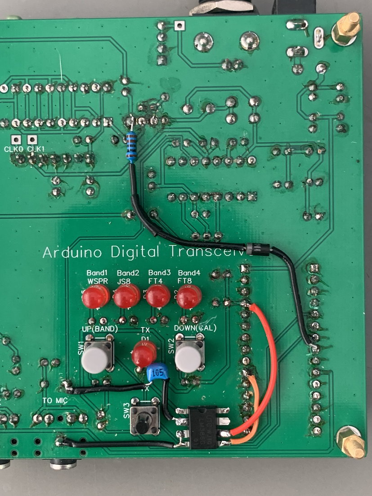
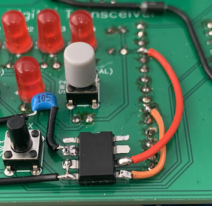

# ADX-S（CRkits共同購入プロジェクト）の改造

 CRkits共同購入プロジェクトで頒布されているADX-S FT8トランシーバ （https://jl1kra.sakura.ne.jp/ADX-S.html
 ) を改造し，PCとの接続をUSBコード1本にしました．  

## "trusdr-audio"によるPCとのUSB接続
ADX-Sは，uSDXプロジェクトの中でWB2CBAが開発したシンプルなデジタルモードトランシーバーADXを，BD6CRが受信部をシングルスーパーに改造・キット化し，CRkitsで頒布されているものです．  
一方，元々のATmega328をフル活用したSDRトランシーバーuSDX（元々，PE1NNZが開発）については，DL2MANがPE1NNZの協力のもとで，(tr)uSDXとして発展させています．  https://dl2man.de/  
この(tr)uSDXプロジェクトの中で，デジタルモードについてUSBシリアル通信でAudio信号伝送とCATを同時に行う方法が開発されています．  
これは，"trusdx-audio"と呼ばれ，PC側のpythonプログラムと(tr)uSDX側のファームウェアによって実現されています．  
PC側のpythonプログラムはOlgierd(https://github.com/olgierd/trusdx-audio/
 )によるオリジナル版を，PE1NNZ(uSDXのファームウェア開発者，threeme3)が発展させ，Windows版のインストーラー付きのパッケージとして配布されています．  
https://github.com/threeme3/trusdx-audio/  （trusdx-audioの詳細はこれらのページをご覧ください．）  

これを利用して，ADX-Sでも同様にUSBケーブル1本で，Audio信号伝送とCATを同時に行うことにしました．  

ハードウェアは，ADC入力用にオーディオアンプの追加が必要で，メイン基板上にオーディオアンプICを直接配線しました．  

ADX-Sのファームウェアは，(tr)uSDXのCATのドキュメントとtrusdx-audioのpythonプログラムを参照しながら作りました．  
”trusdx-audio”のデータ分解能は8bitと低いので，PCへの入力データは大きめにしています．  
このため，WSJT-Xの入力インジケータが赤になることがありますが，問題ありません．  
赤のままの場合には，プログラムの1175行目の割り算の分母を大きくして，信号を小さくしてみてください．  
受信感度は，オーディオケーブルを使用した場合と同程度でした．

具体的な改造は以下の2点です．  

### 1．ADX-Sメイン基板への追加配線 
#### CD2003の出力信号をATmega328PのADC端子に接続するために，CD2003のDET_OUT(11番ピン)とArduino Nano互換ボードのA2ピン(21番ピン)の間にオーディオアンプを挿入します．  
	このアンプは，メイン基板表側とフロントパネルの間に配置しました．
	オーディオアンプにはLM386を使用しました．
	ゲイン200倍で使用するため，1ピンー8ピン間に10uFのコンデンサを接続します．
	2番ピンをCD2003のDET_OUT(11番ピン)に1uFのコンデンサを介して接続します．
	3番ピン，4番ピンをGNDに接続し，6番ピンを5V電源(Arduino Nanoの+5Vピン)に接続します．
	5番ピンをArduino Nano互換ボードのA2ピンに接続します(電源電圧の1/2のオフセット電圧が発生し，ADCへの接続には最適です)．
 
  
  

#### 事前にADX-SのATT, AGC改造をお薦めします(改造を行ったADX-Sでテストしました,中央写真のダイオードと抵抗はATT改造の配線です．)  

### 2．ファームウェア  
#### ADX_S_V1.3JP_trusdr-audio.inoです．    
	ADX-S用のプログラムADX_S_V1.3JP.inoを元にしています．    
	https://jl1kra.sakura.ne.jp/ADX_S_V1.3JP.ino    
	(JP版とWorld Wide版の違いは，40mバンドのJS8モードの設定周波数です(JP版では，JS8に日本ローカルFT8用の7041kHzが設定されている)．）  
	uSDXでは，TS480をシミュレートしてCATを行なっているので，シミュレート対象をTS2000からTS480に変更しました．  
	 
### ファームウェアのインストール  
	ADX-Sのファームウェアの書き込みはArduino IDE環境下で行います．  
	PC(Windows)へのtrusdx-audioのインストール方法や使用方法はPE1NNZ(threeme3)のgithubを参照ください．
	https://github.com/threeme3/trusdx-audio/
	元々のtrusdx-audioと(tr)uSDXの組み合わせでは，PTT方式はWindowsではCATとRTS/DTRが使用可能です．
	しかし，今回のADX-Sのファームウェアの都合上，PTT方式はCATのみの対応です． 
	リグ設定は”TS480"を選択してください(実はなぜかTS2000でも動く)．
	PC側でtrusdx-audioプログラムを作動させなければ，元のままです（なぜかCATのリグ設定TS2000でないとうまく動かない. PTTはVOXに設定）．    
	Hamlibの挙動はよくわかりません．

#### 必要部品  
	オーディオIC LM386：1個
	積層セラミックコンデンサー105：1個
	積層セラミックコンデンサー106：1個
